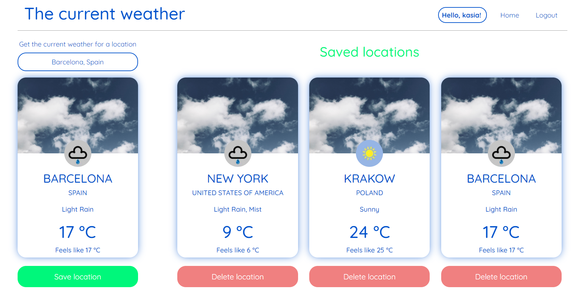
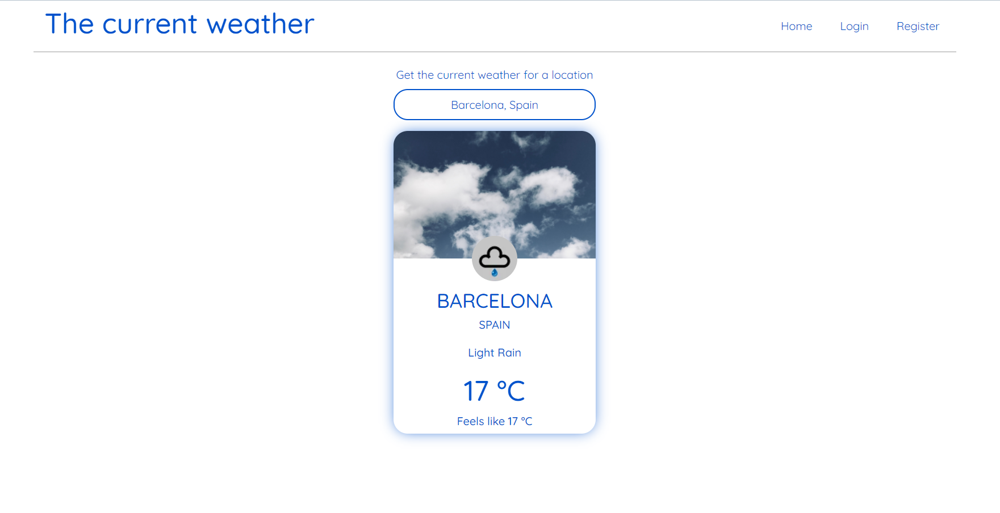
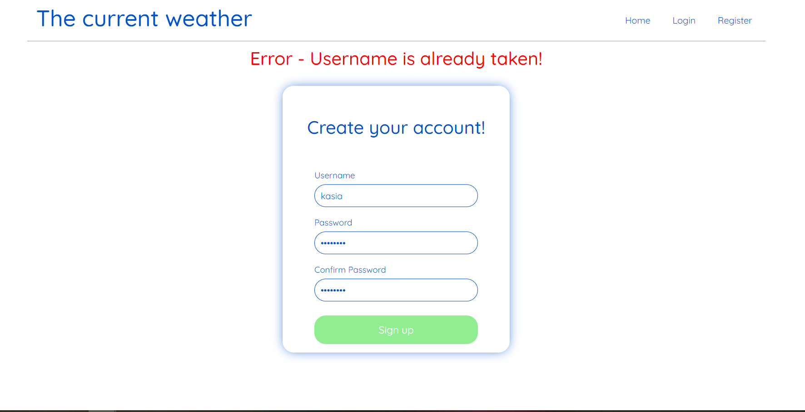

# Weather-app
Application consist of two parts:   

**Backend** - Spring boot application that provides REST API for:
- Getting weather data for a searched location (Weather data from weatherstack.com API)
- User Register and Login with JWT Authentication
- For a logged user: Saving and removing locations to/from PostgreSQL database

**Frontend** - React.js application that: 
- communicates with REST API 
- provides GUI for: Login & Register process, Presenting weather data, saving/removing locations by logged user 
- is responsive

**You can try this app on heroku:**
https://the-current-weather.herokuapp.com

## Technologies 
* Java 11
* Spring Boot
* Spring Security 
* Spring Data
* Maven
* React.js
* HTML, CSS, JS  
* PostgreSQL 

## Screenshoots

### Logged user view

### Not logged in user view

### Register view

### Responsiveness example

